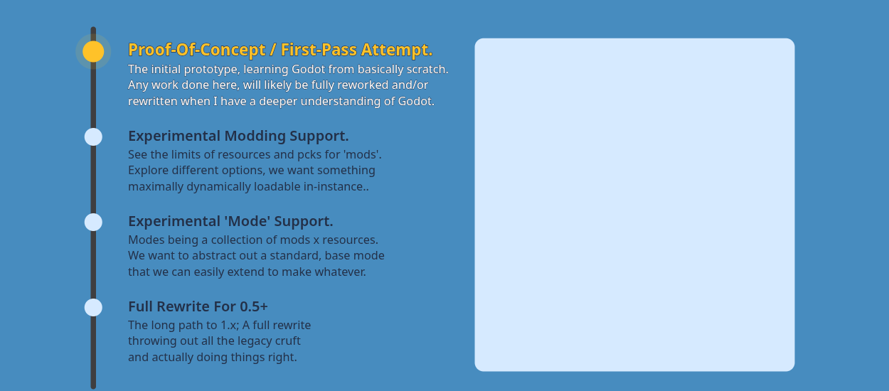

<h1 align="center">GDMode</h1>

<blockquote>
  
Game-Mode / Sandbox System For Godot.

</blockquote>

  

  
⧖ Timeline

  

    
  

You Can View [Megalisp](https://github.com/megalisp)'s Personal Knowledgebase / Notes / Ideas For The Project [Here](https://megalisp.github.io/vault-gday/index.html)
